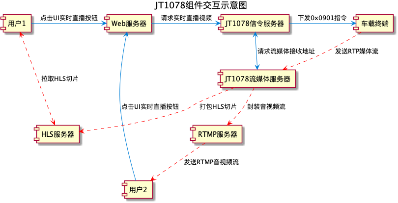
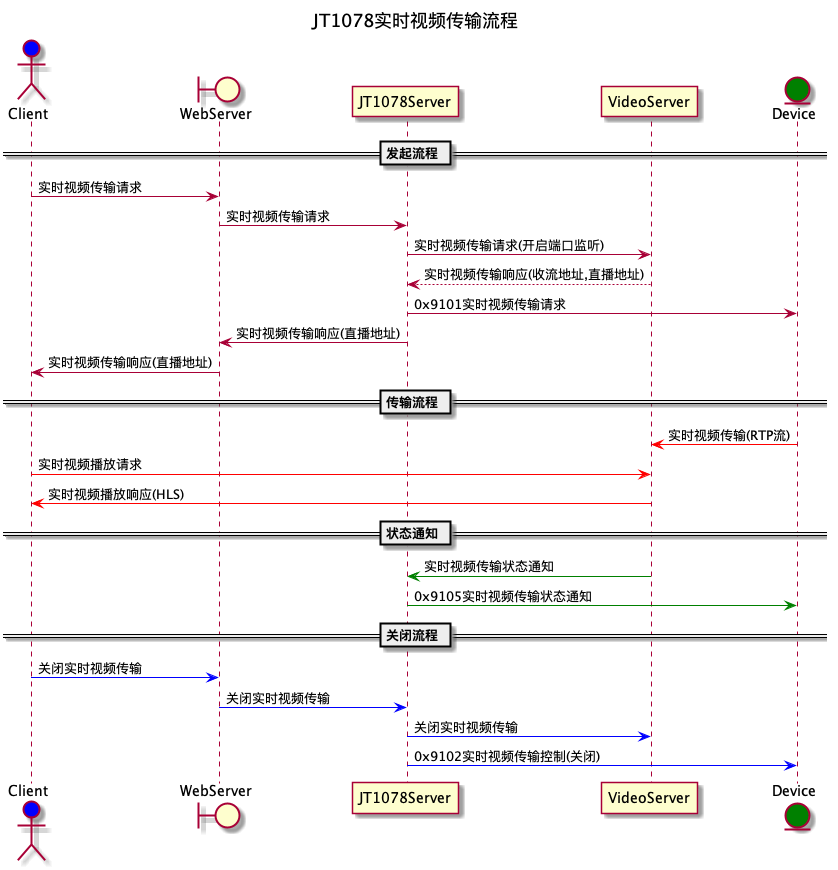

# JT1078协议

JT/T1078 Global navigation satellite system for operating vehicles - Video communication protocol

JT/T1078 道路运输车辆卫星定位系统 视频通信协议

## 组件间交互图

## 实时音视频消息流程图

## 实时音视频流数据传输协议

实时音视频流数据的传输参考RTP协议，使用UDP或TCP承载。 

负载包格式在 IETF RFC3550 RTP定义的基础上补充了消息流水号、SIM卡号、音视频通道号等字段，其负载包格式定义见表19。 
表中定义的 bit 位按照大端模式(big-endian)进行填写。

|    帧头标识     | VPXCCMPT |     包序号     | SIM 卡号 |     逻辑通道号     | 数据类型 |  时间戳   | Last I Frame Interval | Last Frame Interval | 数据体长度 | 数据体 |
| :-------------: | :------: | :------------: | :------: | :----------------: | :------: | :-------: | :-------------------: | :-----------------: | :--------: | :----: |
| FrameHeadMarker | VPXCCMPT | SequenceNumber |   SIM    | LogicChannelNumber | DateType | Timestamp |  LastIFrameInterval   |  LastFrameInterval  | BodyLength |  Body  |

### DateType

| 数据类型 | 分包处理标记 |
| :------: | :----------: |
| DataType |  PacketType  |

### VPXCCMPT

| RTP协议的版本号 | 填充标志 | 扩展标志 | CSRC计数器 | 标志位 | 负载类型 |
| :-------------: | :------: | :------: | :--------: | :----: | :------: |
|        V        |    P     |    X     |     CC     |   M    |    PT    |
