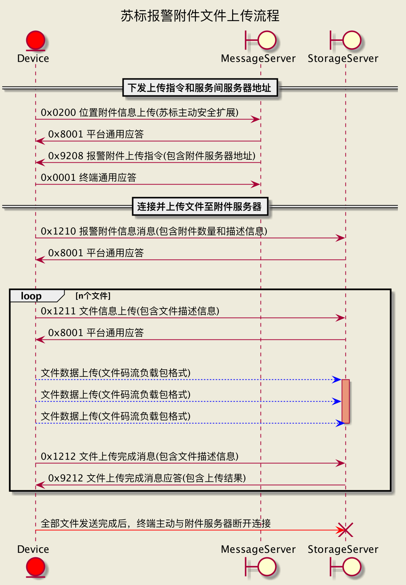

# 江苏省地方标准 DB32/T3610.3

道路运输车辆主动安全智能防控系统 技术规范 第3部分：通讯协议

Technical specification of active safety intelligent prevention and control system for road transportation vehicles Part3：Communication protocol

## 协议依赖

- JT/T808-2011 道路运输车辆卫星定位系统终端通讯协议及数据格式
- JT/T809-2011 道路运输车辆卫星定位系统平台数据交换
- JT/T1078-2016 道路运输车辆卫星定位系统视频通信协议

## 苏标报警附件文件上传流程

